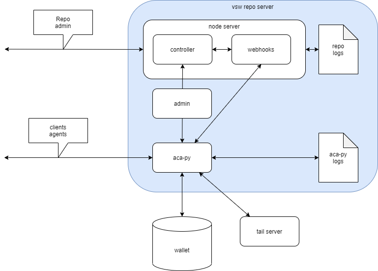

# Verifiable Software - VSW Repo Server

This project consists of the code for running a verifiable software vsw repo. 

## Table of contents

1. [ About the project ](#About)
2. [ Getting started ](#Getting)
3. [ Run vsw repo locally ](#locally)
4. [ Run vsw repo inside docker](#runindocker)
5. [ Run docker in AWS ](#aws)
6. [ Verifiable Software ](#VSW)

<a a name=#About></a>
## About the project

VSW Repo is server part of the project. Client part can be be found in a separate git repo. For details about the verifiable software ecosystem, see [vsw](https://github.com/verifiablesoftware/vsw) which contains the `vsw` command line tool for client useage. This VSW Repo is intended to to be used as VSW server. Internal structure of the Node.js based repo server can been seen in the image below.



<a a name=#Getting></a>
## Getting started

Clone this vsw repo to youur local machine with 
```
git clone https://github.com/verifiablesoftware/vsw-repo
```

There are a set of shell scripts provided with the code repository. Some explanation of the scripts can be found below.

<a a name=#locally></a>
## Run vsw repo locally

provision the aca-py agent and create wallet. The wallet has to be created first any case by using provision parameters for aca-py.

```
./repo-provision-local.sh
```

when running this, user will be prompted (if the wallet is not existing already)
``` 
Created new wallet
Wallet type: indy
Wallet name: Repo.Local
Created new public DID: G5ZDvU1Y7hTKnQR6xXXXX
Verkey: 9DfRgQevqRE2HAC9n4T7whfLBet8yTa6jUWzXZXXXXXX

----

Please select an option:
 1. Accept the transaction author agreement and store the acceptance in the wallet
 2. Acceptance of the transaction author agreement is on file in my organization
 X. Skip the transaction author agreement   
 ```
 and before accepting, register DID and Verkey to [sovrin buildernet](https://selfserve.sovrin.org/) 


Note: provisioning *repo-provision-local.sh* variables must match the variables defined in the *repo-start-local.sh*
After provisioning, go to /app directory and use 

```
npm install 
```

and start the aca-py agent by using script: 

```
./repo-start-local.sh
```
this script starts node server with [nodemon](https://nodemon.io/), see package.json and start-dev script

or for Visual Studio Code debugging [VS Code](https://code.visualstudio.com/)
, there is ```Run vsw-repo locally start``` launch.json that launches local vsw-repo debugging.


<a name=#runindocker></a>
## Run inside the docker

build docker image(s) (requires wallet to start the vsw-repo) 

for vsw-repo

```
./repo-local-build.sh
```

or

```
docker build -f Dockerfile.dev -t vsw-repo .
```

## run vsw-repo container with docker
and for example use the ports 8040-8042 for repo, repo api and repo controller. Please, check the port mappings. 
```
docker run -d --name vsw-repo -p 8060:8040 -p 8061:8041 -p 8062:8042  vsw-repo
```

<a name=#AWS></a>
## Run vsw-repo in AWS

details about AWS can be found [AWS](./AWS_README.md) and it is meant for development and debuggign phase only. DevOps pipeline takes care building the docker images and deploying the image to AWS. 
when vsw-repo is running in the AWS cloud EC2 URL is something like this:

http://ec2-3-XXX-XXX-46.us-east-2.compute.amazonaws.com:8060

this has to be given to docker image when starting the vsw-repo docker image in AWS. 

<a name=#VSW></a>
## Verifiable Software
For informal discussions, we use slack : vswhq.slack.com

Anyone is welcome to join the slack channel using this invitation link: 
https://join.slack.com/t/vswhq/shared_invite/zt-kxvaycqc-v5dSDLfpUVevtrZsHsOr9Q
Slack invitation link is timed. The above link is going to expired on Feb 12, 2021. We will try to watch and update the link timely. In case we missed it, or it isn't working for you, please file a github issue to alert us. Welcome to the vsw project.


